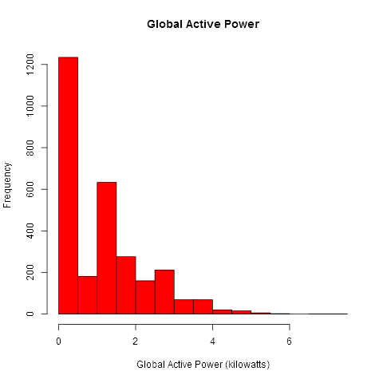
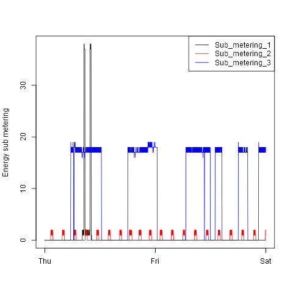
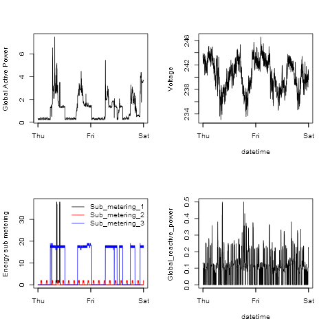

## Introduction

This assignment uses data from
the <a href="http://archive.ics.uci.edu/ml/">UC Irvine Machine
Learning Repository</a>, a popular repository for machine learning
datasets.

* <b>Dataset</b>: <a href="https://d396qusza40orc.cloudfront.net/exdata%2Fdata%2Fhousehold_power_consumption.zip">Electric power consumption</a> [20Mb]

There is four scripts for four plots.
Each script can download and process the data.

In particular, Data & Time combined to DataTime column. Dataset was subsetted (only data from 2007-02-01 to 2007-02-02 was used).

Processed data will be saved to "data/df.tidy.Rda" file.

The required four plots are shown below.

### Plot 1

### Plot 2

### Plot 3

### Plot 4

